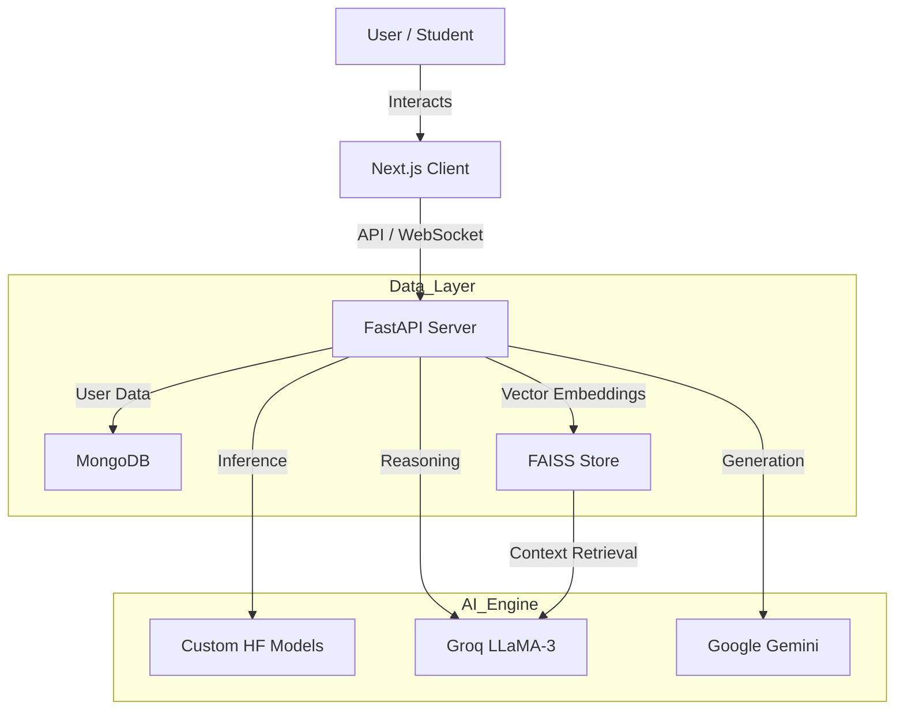

# Learn-Ease: Intelligent AI Learning Ecosystem


**Learn-Ease** is an enterprise-grade, AI-driven educational platform designed to solve information overload. By leveraging a **Hybrid AI Architecture** (Custom Fine-Tuned Models + LLMs), it transforms static educational content into an interactive, personalized, and measurable learning experience.

> **Value Proposition:** We bridge the gap between passive reading and active retention through RAG-based mentorship, semantic evaluation, and automated content generation.

---

## **🎯 The Problem & Solution**

**The Problem:** Students and professionals struggle to retain information from dense textbooks. Traditional learning management systems (LMS) are static and lack personalized feedback.

**The Solution:** Learn-Ease automates the study process:
* **Instant Content Synthesis:** Summaries, Notes, and Flashcards generated in seconds.
* **Active Recall:** Automated Quizzes with semantic grading (grading based on meaning, not just keywords).
* **24/7 Mentorship:** A RAG-Chatbot that answers questions strictly from the provided material (Zero Hallucination).

---

## **🛠 Core Modules & Features**

### **1. AI Content Generation Engine**
| Feature | Tech Stack | Utility |
| :--- | :--- | :--- |
| **Smart Summarization** | **Cohere Command R+** | Extracts high-value concepts from dense text with high accuracy. |
| **Deep Notes & Flashcards** | **Google Gemini 1.5 Pro** | Creates structured study materials for active recall. |
| **Glossary Generation** | **SpaCy + WordNet** | Auto-detects jargon and provides context-aware definitions. |

### **2. Intelligent Assessment System**
- **Semantic Grading:** Uses **all-MiniLM-L6-v2** embeddings to grade user answers based on vector similarity ($\frac{\sum CosineSimilarity}{N}$), moving beyond simple keyword matching.
- **Feedback Loop:** Provides detailed explanations for incorrect answers, driving continuous improvement.

### **3. Personalized Learning Path**
- **RAG Chatbot:** Retrieves context from **FAISS Vector Stores** to provide book-specific answers using **Groq LLaMA-3 (70b-versatile)**.
- **AI Recommendations:** Analyzes quiz performance to suggest specific topics for revision.

### **4. Collaborative Suite**
- **Real-Time Communication:** Socket-based group messaging and forums.
- **Progress Analytics:** Visualizes learning trends using **Recharts** and **Matplotlib**.

---

## **📐 System Architecture**

The platform is built on a scalable, modular architecture designed for high availability.



-----

## **💻 Technical Stack**

*   **Frontend:** Next.js 15 (App Router), React 19, TypeScript, Tailwind CSS 4, Recharts.
*   **Backend:** FastAPI (Python), WebSocket, Pydantic.
*   **Database:** MongoDB (NoSQL), FAISS (Vector DB).
*   **AI/ML:** LangChain, Sentence-Transformers, PyTorch, Google Generative AI, Groq SDK.
*   **Infrastructure:** Modular architecture ready for containerization (Docker).

-----

## **🚀 Getting Started**

Follow these instructions to set up the project locally.

### **Prerequisites**
*   **Node.js**: v18 or higher
*   **Python**: v3.10 or higher
*   **MongoDB**: Local instance or Atlas URI

### **1. Backend Setup**

Navigate to the backend directory:
```bash
cd backend
```

Create a virtual environment:
```bash
# Windows
python -m venv venv
.\venv\Scripts\activate

# Mac/Linux
python3 -m venv venv
source venv/bin/activate
```

Install dependencies:
```bash
pip install -r requirements.txt
```

**Environment Configuration:**
Create a `.env` file in the `backend` root directory with the following keys:
```env
# Database
DATABASE_URL=mongodb://localhost:27017
JWT_SECRET_KEY=your_super_secret_key

# AI Services
GOOGLE_API_KEY=your_gemini_key
GROQ_API_KEY=your_groq_key
COHERE_API_KEY=your_cohere_key

# Optional (for S3 support)
AWS_ACCESS_KEY=your_aws_key
AWS_SECRET_KEY=your_aws_secret
AWS_REGION=us-east-1
S3_BUCKET_NAME=your_bucket_name
```

Run the server:
```bash
uvicorn main:app --reload
```
The API will be available at `http://localhost:8000`.

### **2. Frontend Setup**

Navigate to the frontend directory:
```bash
cd frontend
```

Install dependencies:
```bash
npm install
# or
yarn install
```

Run the development server:
```bash
npm run dev
```
The application will be live at `http://localhost:3000`.

### **3. Docker Setup (Alternative)**

If you have Docker and Docker Compose installed, you can run the entire stack with a single command:

```bash
# From the root directory
docker-compose up --build
```
This will start:
*   Backend API at `http://localhost:8000`
*   Frontend Client at `http://localhost:3000`
*   MongoDB Instance

-----

## **📂 Repository Structure**

```text
Learn-Ease/
├── backend/                             # Python FastAPI Microservice
│   ├── core/                            # Core Infrastructure (Config, DB, Security)
│   ├── models/                          # Pydantic Schemas (Data Validation)
│   ├── routers/                         # API Controllers (REST Endpoints)
│   ├── services/                        # Business Logic Layer (AI, Vector, Quiz)
│   └── user-book-files/                 # Local Data Lake (PDFs, Embeddings)
│
├── frontend/                            # Next.js 15 Client (App Router)
│   ├── src/app/                         # Pages & Routing
│   ├── src/components/                  # UI Design System
│   └── public/                          # Static Assets
│
└── requirements.txt                     # Backend Dependencies
```

-----

## **📩 Contact**

This project is currently under active development. For investment opportunities, technical inquiries, or demo requests, please contact:

**Mohsin Niaz**
*   **Role:** Lead Developer / Co-Founder
*   **Email:** [mohsin.nyz@gmail.com](mailto:mohsin.nyz@gmail.com)
*   **LinkedIn:** [linkedin.com/in/mohsinnyz](https://linkedin.com/in/mohsinnyz)

**Talal Amjad**
*   **Role:** Lead Developer / Co-Founder
*   **Email:** [talalamjad47@gmail.com](mailto:talalamjad47@gmail.com)
*   **LinkedIn:** [linkedin.com/in/talalam23](https://linkedin.com/in/talalam23)

-----

*© 2025 Learn-Ease. All Rights Reserved. Proprietary Software.*